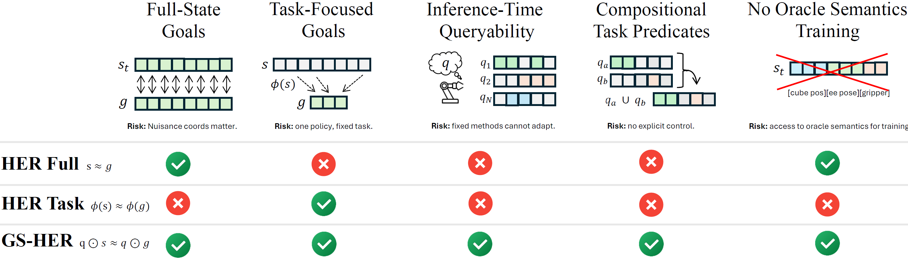
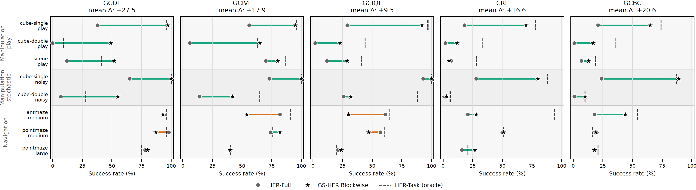

# (GS-HER) Goal Sets, Not Goal States: Queryable Robot Goals through Goal-Set Hindsight Relabeling

[[Paper]](https://arxiv.org/pdf/2606.09476) by [Carlos Vélez García](https://github.com/cvg25), Miguel Cazorla and Jorge Pomares.

Official implementation of GS-HER (Goal-Set Hindsight Experience Replay).

GS-HER revisits hindsight relabeling for offline goal-conditioned reinforcement learning. Instead of relabeling future states as fixed goal states, GS-HER relabels them as goal sets, enabling a single policy to answer different goal queries at inference time.


**From many goal states to many goal predicates.** HER-Full supports annotation-free relabeling but fixes success to full-state matching. HER-Task focuses learning through a fixed oracle projection ϕ, but fixes the task semantics before training. GS-HER avoids oracle task projections while conditioning on a query q, allowing the same model to recover full-state goals, task-focused goals, and compositional predicates at inference time.

## Abstract
Hindsight relabeling usually turns achieved future states into exact goals, which can overconstrain offline robot learning when task success depends only on a subset of the state. We propose Goal-Set Hindsight Relabeling (GSHER), a predicate-level generalization of HER in which achieved states certify query-defined goal sets rather than singleton goal states. A binary query specifies which variables define success, making the goal predicate an inference-time input while leaving the underlying offline GCRL algorithm unchanged. Across OGBench tasks and five offline goal-conditioned learners, GS-HER improves performance when full-state goals are bottlenecked by nuisance dimensions and turns hindsight relabeling into a reusable goal interface: one checkpoint can answer multiple robot goal predicates without retraining.

## Motivation

Standard Hindsight Experience Replay (HER) assumes that a future state corresponds to a single goal. In practice, many dimensions of a state are irrelevant to task success.

For example, when placing a cube at a target location, success may only depend on the cube position, while robot joint configurations, velocities, and other state variables are nuisance dimensions.

GS-HER addresses this limitation by introducing a **query-conditioned goal interface**:

* Train once using reward-free trajectories.
* Query different goal semantics at inference.
* Avoid committing to a single task projection during training.
* Support compositional and task-dependent success definitions.

---

## Key Idea

Instead of relabeling:

```text
s_t  ->  future state s_g
```

GS-HER relabels:

```text
s_t  ->  (future state s_g, query q)
```

where the query specifies **which dimensions of the achieved future state matter**.

Examples:

```text
q = cube position
q = cube orientation
q = robot pose
q = full state
q = arbitrary combination of the above
```

The policy learns to interpret the query and reach the corresponding subset of the future state.

## Method

Given a future state:

```math
g = s_{t+k}
```

GS-HER samples a goal query:

```math
q \in \{0,1\}^{|s|}
```

and constructs a goal-set objective where only the queried dimensions contribute to success.

During training:

```text
(state, action, future_state, query)
```

During inference:

```text
(state, desired_goal, query)
```

This enables a single model to solve multiple downstream goal definitions without retraining.

---

## Features

### Queryable Goals

Specify what constitutes success at inference time.

### One Model, Many Tasks

A single policy can solve multiple goal-reaching objectives.

### Compositional Goal Semantics

Queries can combine semantic components:

```text
Cube Position
Cube Orientation
Robot Pose
Gripper State
...
```

### Semantics-Agnostic Training

Task semantics do not need to be fixed before training.

---

## Results

GS-HER is evaluated on the OGBench benchmark across multiple offline goal-conditioned RL backbones.

Main findings:

* Consistently improves over full-state HER.
* Recovers much of the benefit of oracle task projections.
* Particularly effective when nuisance dimensions dominate the state space.
* Enables inference-time goal specification while maintaining standard offline GCRL training.



---

## Citation

If you find this work useful, please cite (Arxiv preprint to be released soon):

```bibtex
@article{velezgarcia2026gsher,
  title   = {Goal Sets, Not Goal States: Queryable Robot Goals through Goal-Set Hindsight Relabeling},
  author  = {Carlos Vélez-García and Miguel Cazorla and Jorge Pomares},
  year    = {2026},
  Eprint  = {arXiv:2606.09476}
}
```

---

## Acknowledgements

This work was developed at:

* INESCOP – Footwear Technology Centre
* University of Alicante

---
